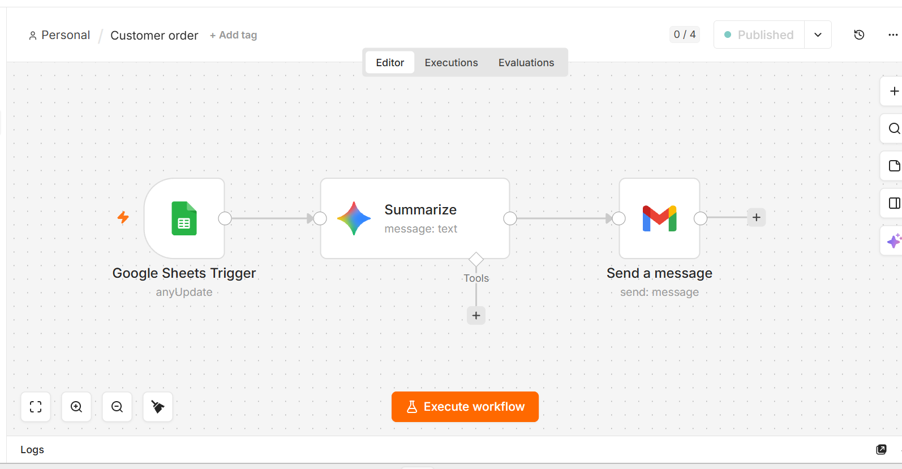

# Customer Order Notification Automation

## 📌 Overview

This workflow automates customer order notifications using Google Sheets and Gmail.

Whenever a new customer order is added to Google Sheets, n8n automatically sends a confirmation email to the customer.

---

## 🚀 Features

- Reads new customer orders from Google Sheets
- Extracts customer information
- Sends an automated confirmation email
- Eliminates manual email sending

---

## 🛠 Technologies Used

- n8n
- Google Sheets
- Gmail
- Google OAuth

---

## Workflow

Google Sheets
↓

Read New Row
↓

Extract Customer Data
↓

Send Email

---

## Nodes Used

- Google Sheets Trigger
- Gmail
- Set

---

## Example

Input

Customer Name: John Doe

Email: john@gmail.com

Product: Laptop

Output

Subject:
Order Confirmation

Body:

Hello John,

Thank you for purchasing Laptop.

Your order has been received.

Regards,
Support Team

---

## Workflow Screenshot

---

## Exported Workflow

CustomerOrder.json

---

## Author

Arbish Munawar